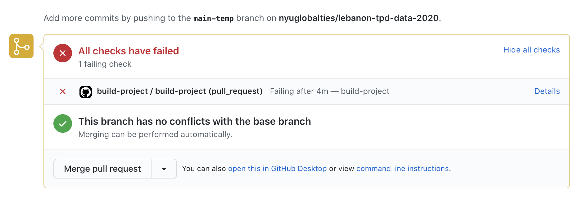
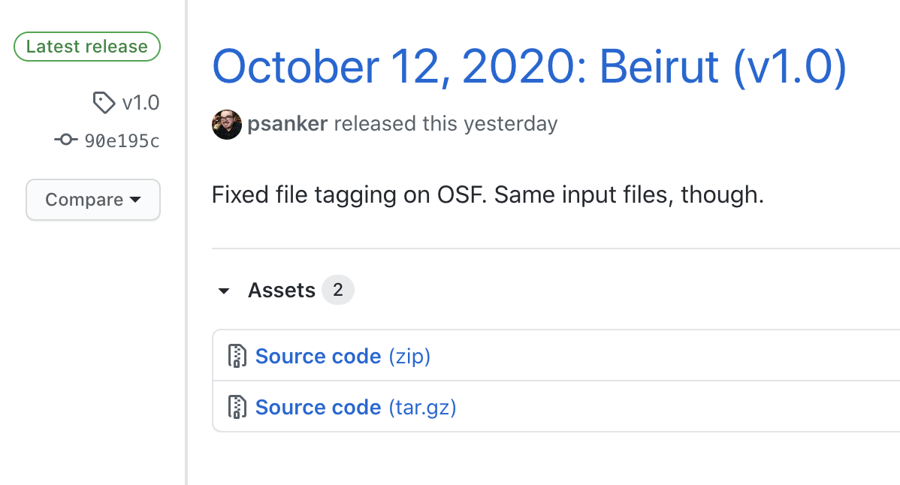
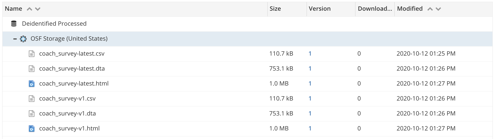
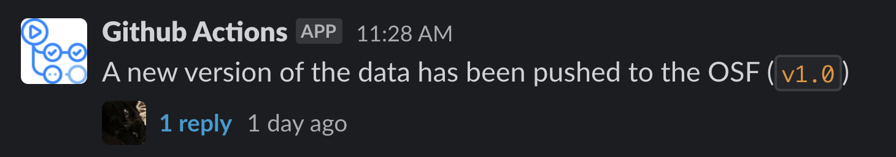

class: middle, center
background-image: url('images/new-way-things-work-pipeline.jpg')
background-size: auto 100%

<style>
:root {
  --nyu-yellow: #ecaa00;
  --nyu-red: #c50f3c;
}

pre {
  overflow: hidden;
}

.yellow {
  color: var(--nyu-yellow);
}

.red {
  color: var(--nyu-red);
}

.smaller-footnote {
  font-size: 0.6em !important;
}
</style>

```{r setup, include=FALSE}
options(htmltools.dir.version = FALSE)

library(xaringanthemer)
style_mono_accent(
  text_font_google = google_font("Montserrat", "300", "300i"),
  code_font_google = google_font("Fira Mono")
)

library(magrittr)
```

---
class: middle, center

# Before we begin...

All materials in this presentation can be downloaded from 

**>> [this presentation's repository](`r params$repo`) <<**

## 🚀

---
class: middle, center, inverse

# Background

---
background-image: url('images/icon-grid.png')

# The Data Team Project Stack

---
background-image: url('images/icon-grid-labels.png')

---
background-image: url('images/icon-grid-authors.png')

---
background-image: url('images/pipeline-outline.png')

---
class: middle

# Problem

### This pipeline is just for the data processing steps... How do we <span class='red'><em>consistently</em></span> link _other_ phases to this?

---
class: middle, center, inverse

# Solution

## Build a low-cost <span class='yellow'><em>continuous integration & delivery</em></span> scheme within the NYU IT structure that links together <span class='yellow'><em>all</em></span> stages in the research process to enhance transparency and reproducibility.

---

# Continuous Integration

> **Continuous Integration** (CI) is the process of automating the build and testing of code every time a team member commits changes to version control... Committing code triggers an automated build system to grab the latest code from the shared repository and to build, test, and validate the full main branch.
>
> &mdash; _Microsoft Azure DevOps Docs_<sup>1</sup>

### Nomenclature

- **"Commit"** means _"create new version"_ (v.) or _"version"_ (n.) for this presentation. 
- **"Branch"** means a particular code lineage/history in a project. **Git**, the version control system most commonly employed, can support _multiple_ file/code histories whereas Box only supports one.

.footnote[

(1): https://docs.microsoft.com/en-us/azure/devops/learn/what-is-continuous-integration

]

---
class: inverse
background-image: url('images/ci-cd-with-gh-actions_1.png')
background-position: center
background-attachment: fixed

# Continuous Integration

---

# CI in Action

.center[

```{r, echo=FALSE, out.width=550}

```

]

Ling was working on tidying the variable descriptions for a couple datasets, and this is the task to merge her work with the main branch of code (called a "pull request"). One of the metadata CSV files had the wrong file encoding (happens all the time with Excel), which caused the pipeline checks to error.

### CI prevented potentially breaking code/data from compromising the output data.

---

# Continuous Delivery

> **Continuous Delivery** (CD) is the process to build, test, configure and deploy from a build to a production environment. Multiple testing or staging environments create a Release Pipeline to automate the creation of infrastructure and deployment of a new build.
>
> &mdash; _Microsoft Azure DevOps Docs_<sup>1</sup>

Even though this definition is _fairly_ broad, it is still more targeted for software development. However, the idea can be brought into a research setting as well.

.footnote[

(1): https://docs.microsoft.com/en-us/azure/devops/learn/what-is-continuous-delivery

]

---
class: inverse
background-image: url('images/ci-cd-with-gh-actions_2.png')
background-position: center
background-attachment: fixed

# Continuous Delivery

---

# CD in Action

.center[

```{r, echo=FALSE, out.width=400}

```

]

Github releases are based on "tags" (the `v1.0`). The `90e195c` is the specific commit fingerprint for `v1.0`. 

For data, the version number has a specific meaning that is comprehensible for all personnel:

.center[

`[data revision].[metadata revision]`

]

A researcher can be guaranteed that if the data revision ("major") number changes, then their analyses may need to be updated.

---

# CD in Action

.center[

```{r, echo=FALSE, out.width=700}

```

]

Datasets available for analysis are tagged with both `-latest` and their version number `-v[number]`, in case a researcher wants to use the latest data or a specific version of the data.

---

# CD in Action

.center[

```{r, echo=FALSE}

```

]

Part of our ongoing test of Slack, Github Actions notifies all members of the Lebanon TPD project that a new version of the data or codebooks is available, after successful delivery.

.footnote[

That's my cat... and profile picture.

]

---
class: center, middle, inverse

# Cost / Benefit Analysis of CI/CD Approach

> There is no such thing as a free lunch... but there can be very cheap ones.

---

# Cost / Benefit of CI/CD Approach

.middle[

| Benefit |
|:----|
| `r "\u2705"` Clear code history |
| `r "\u2705"` Code and data tests guarantee that analyses are correct |
| `r "\u2705"` Branch-based development guards collaboration from "version clobbering"<sup>1</sup> |
| `r "\u2705"` Execution on external computers protect against the "works on my machine" problem |
| `r "\u2705"` Data import can be an integration step, <em>linking data collection directly to processing</em> |

]

.footnote[

(1): No need for file names like "_FINAL_v2_20200321_psa.R"

]

---

# Cost / Benefit of CI/CD Approach

.middle[

| Cost | Potential Solution |
|:----|:----|
| `r "\u274C"` Setup time investment _can_ be non-trivial<sup>1</sup> | Work on data processing stage has yielded a _reasonably flexible_ template for open source tools |
| `r "\u274C"` Proprietary software difficult to integrate | Can now martial data/code to and from NYU HPC, which has all of the proprietary software we use |
| `r "\u274C"` OSF storage limited to 5GB per project and cannot integrate with NYU Box | A proposal to use AWS S3 (which is very cheap and a good investment for the Center long-term) is under way |

]

---
class: center, middle, inverse

# Next Steps

# 💡

---

# Automate the Link

This setup makes it clear to collaborators about what data is available and _how exactly_ the data was created. Collaborators are notified when new datasets are available on the OSF, and they have a clear selection of tagged data releases.

### But what if a researcher wants their analysis code to re-run with the latest data, <span class='red'><em>without</em></span> having to manually instruct it to run?

---
class: inverse
background-image: url('images/ci-cd-with-gh-actions_3.png')
background-position: center
background-attachment: fixed

# Change CD...

---
background-image: url('images/ci-cd-with-gh-actions_4.png')
background-position: center
background-attachment: fixed

### To be explored with NYU-UNC Collaboration

---
class: center, middle, inverse

# _Questions?_
